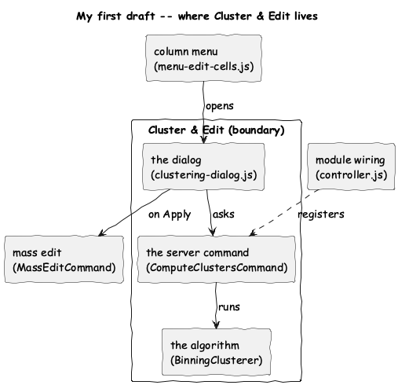
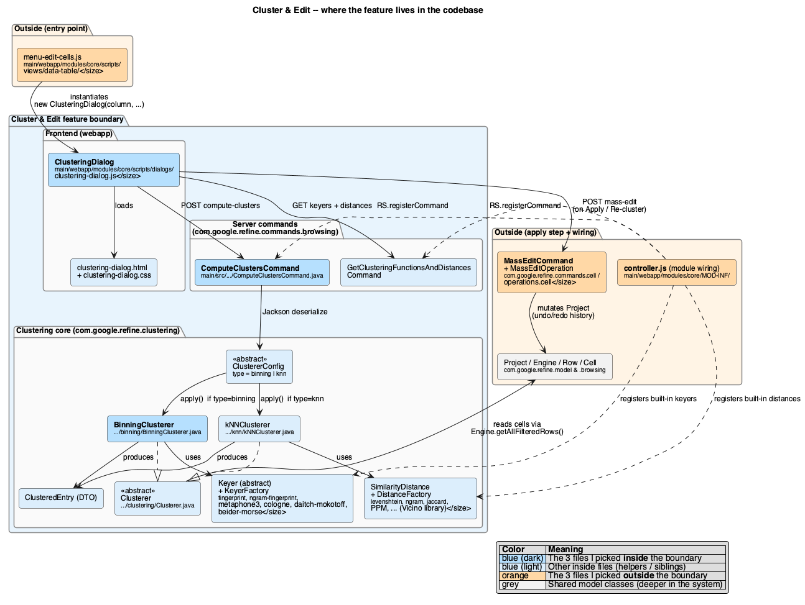
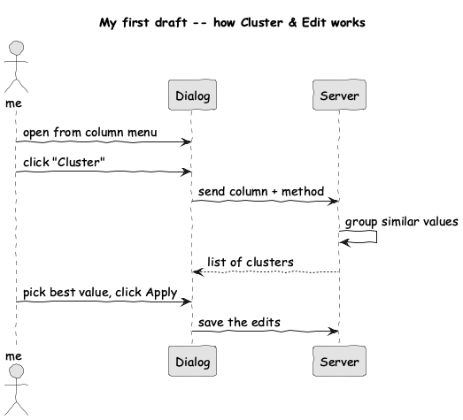
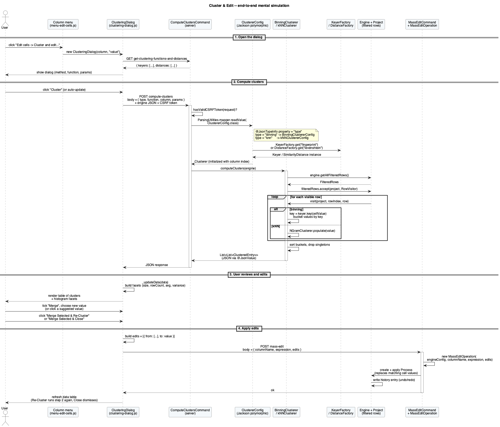

# How do you think it works, Part 2

- Feature chosen: Cluster and Edit ([OpenRefine](https://github.com/OpenRefine/OpenRefine))
- Author: Zhenyu Song (zhenyus4@uci.edu)

---

[TOC]

---

## 1. Disclosure of generative AI use

I used a generative AI assistant (Cursor / Claude) in two limited ways.

- **How I used it.** I wrote this document and drew the two first-draft sketches myself. I asked the AI to (1) upgrade my two rough sketches into more polished, more detailed diagrams that line up with the actual code, and (2) clean up the grammar and phrasing of my prose. The structure of the document, the choice of which files are inside vs. outside the boundary, the rationale for each pick, and the runtime walk-through are mine; I also placed the images into the document myself.
- **What it produced.** Two more detailed PlantUML diagrams (`diagrams/detailed_location.puml` and `diagrams/detailed_simulation.puml`) built from my drafts, plus grammar/wording suggestions on my draft text.
- **What I changed.** Verified the AI diagrams against the source files, tightened a few labels, and replaced an invalid `abstract` keyword with `<<abstract>>` stereotypes so PlantUML would render. For the prose, I accepted grammar fixes but kept my own wording where the AI's rewrites drifted from my intent.
- **Why.** To make sure the diagrams reflect the real code (not just plausible-looking output) and that the writing still sounds like me.

---

## 2. Mental model — where the feature lives

### My first draft



I drew a rough boundary around what I think of as "the feature" — the dialog, the server command, and the clustering algorithm — and put the three pieces that only touch it outside: the column menu that opens the dialog, the generic mass-edit machinery the Apply step hands off to, and the module wiring that registers the command and the built-in keyers.

### A more detailed view (AI generated)



### Files inside the boundary (my picks)

1. [`main/webapp/modules/core/scripts/dialogs/clustering-dialog.js`](../main/webapp/modules/core/scripts/dialogs/clustering-dialog.js) — the entire UI of the feature: builds the dialog, sends the `compute-clusters` request, renders the cluster table, and posts the merge.
2. [`main/src/com/google/refine/commands/browsing/ComputeClustersCommand.java`](../main/src/com/google/refine/commands/browsing/ComputeClustersCommand.java) — the only HTTP endpoint that runs a clustering pass. It deserialises the `ClustererConfig` and returns the clusters as JSON.
3. [`modules/core/src/main/java/com/google/refine/clustering/binning/BinningClusterer.java`](../modules/core/src/main/java/com/google/refine/clustering/binning/BinningClusterer.java) — the default "Key collision" algorithm: walks the filtered rows, applies the chosen `Keyer`, and groups values with the same key. Its sibling [`kNNClusterer.java`](../modules/core/src/main/java/com/google/refine/clustering/knn/kNNClusterer.java) handles "Nearest neighbor".

### Files outside the boundary (directly connected)

1. [`main/webapp/modules/core/scripts/views/data-table/menu-edit-cells.js`](../main/webapp/modules/core/scripts/views/data-table/menu-edit-cells.js) — the column header's "Edit cells" submenu. Only one line (`new ClusteringDialog(column, "value")`) knows the feature exists; the rest of the file is unrelated.
2. [`main/src/com/google/refine/commands/cell/MassEditCommand.java`](../main/src/com/google/refine/commands/cell/MassEditCommand.java) — receives the Apply step's `from -> to` edits and (with `MassEditOperation`) mutates the cells. A generic mass-edit handler shared by other features.
3. [`main/webapp/modules/core/MOD-INF/controller.js`](../main/webapp/modules/core/MOD-INF/controller.js) — module bootstrap that registers the `compute-clusters` command and the built-in keyers and distances. Wiring, not feature logic.

---

## 3. Mental simulation — how the feature works

### My first draft



In my head the runtime story is short: the user opens the dialog, presses *Cluster*, the server groups similar values, the dialog shows the groups, the user picks the values to merge, and the server saves the edits. That is the five-message version above.

### A more detailed view (AI generated)



### Walk-through of the detailed sequence

- **Open the dialog.** The column menu instantiates `ClusteringDialog`, which fetches the available keyers and distances.
- **Compute clusters.** The user clicks *Cluster*; the dialog `POST`s `{ type, function, column, params }` to `/command/core/compute-clusters`. The command deserialises the polymorphic `ClustererConfig` and looks up the chosen `Keyer` or `SimilarityDistance` from its factory.
- **Walk the data.** `clusterer.computeClusters(engine)` runs a `RowVisitor` over the filtered rows — either binning by key (binning) or feeding values into an `NGramClusterer` (kNN).
- **Build the response.** Single-value buckets are dropped; the rest is serialised to JSON as `List<List<ClusteredEntry>>`.
- **Render and pick.** The dialog renders the cluster table with four histogram facets; the user ticks clusters to merge and types or clicks the canonical value.
- **Apply.** The dialog `POST`s the edits to `/command/core/mass-edit`; `MassEditCommand` runs a `MassEditOperation` that mutates the cells and writes a history entry. The dialog then re-clusters or dismisses.

---

## Reproducing the diagrams

The PlantUML sources live alongside the PNGs in `assignment/diagrams/`. To re-render them:

```bash
java -Djava.awt.headless=true -jar plantuml.jar -tpng assignment/diagrams/*.puml
```

(The detailed location diagram uses `!pragma layout smetana` so it does not require Graphviz.)
