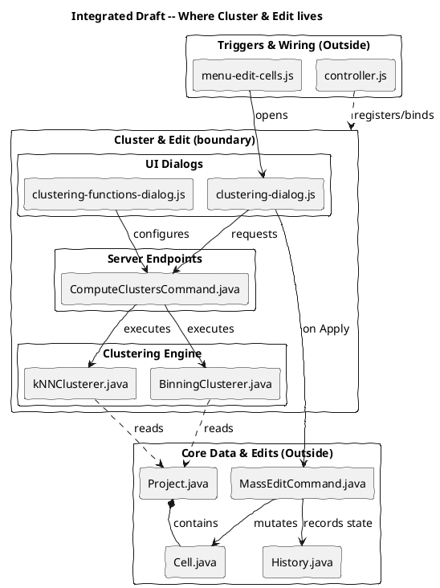
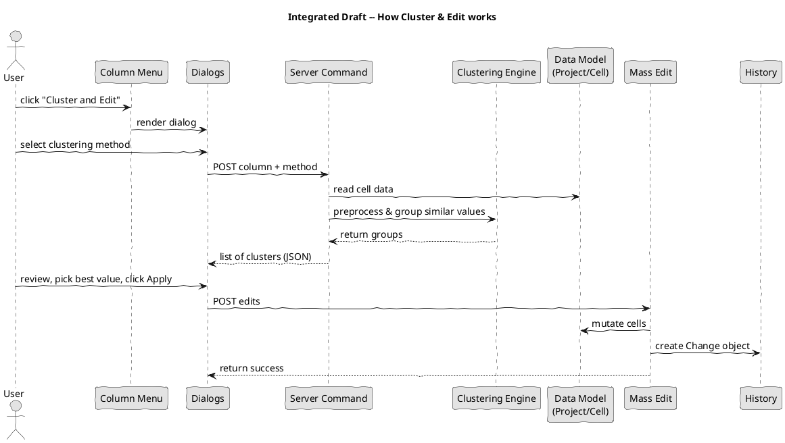

# How do you think it works, part 3

## Rationale & Team Integration

This document integrates the individual models from our team (Zhenyu, Karry, Kingson, and Mouhamed) to form a comprehensive collective understanding of the "Cluster and Edit" feature in OpenRefine. Instead of limiting our scope to a strict three-in/three-out rule, we have opted to include all reasonable and valid components identified by the team to create a robust structural and runtime model. 

We used Zhenyu's draft diagrams as our foundational starting point—intentionally excluding the overly detailed AI-generated variants to maintain focus on the core conceptual boundaries—and then layered in the insights from Karry, Kingson, and Mouhamed to ensure no critical piece was left out.

### AI Disclosure
Generative AI (Gemini) was utilized to help synthesize the different perspectives of our team members into a cohesive narrative, generate the combined PlantUML diagrams, and polish the phrasing of this document. We verified the resulting diagrams against our original notes and compiled the PlantUML source code to ensure syntactical correctness and accurate representation of our joint understanding.

---

## 1. Integrated Location Model

Our collective location model defines the boundaries of the "Cluster and Edit" feature by distinguishing which files form the core functionality versus those that serve as external dependencies or underlying state.

### Files "Inside" the Boundary

1. **UI Dialogs (`clustering-dialog.js`, `clustering-functions-dialog.js`)**: We collectively agree these are the primary user interfaces for clustering. They handle user interactions, render the cluster table, and configure/send clustering requests to the backend. (Supported by Zhenyu, Karry, Kingson, and Mouhamed's "Clustering Dialog").
2. **Server Endpoints (`ComputeClustersCommand.java`)**: This is the backend API endpoint that processes the clustering request, orchestrates the underlying algorithms, and serializes the result into JSON. (Identified by Zhenyu, Karry, and Kingson).
3. **Clustering Engine (`BinningClusterer.java`, `kNNClusterer.java`)**: The core algorithm implementations that execute the keying and distance logic to group similar values into buckets. (Identified by Zhenyu, Karry, and conceptually described by Mouhamed as the "Clustering Engine").

### Files "Outside" the Boundary

1. **Triggers & Wiring (`menu-edit-cells.js`, `controller.js`)**: 
   - `menu-edit-cells.js` is the column dropdown menu UI. It merely acts as a trigger to instantiate and open the clustering dialog. (Identified by Zhenyu and Kingson).
   - `controller.js` is the module bootstrap that wires and registers the clustering functions when the program initializes, but isn't part of the active feature logic itself. (Identified by Zhenyu and Kingson).
2. **Core Data (`Project.java`, `Cell.java`)**: Represents the underlying data storage (the Data Model). While the clustering engine must read from it, the project and its individual cells are global entities that exist entirely independent of the clustering feature. (Identified by Karry and Mouhamed).
3. **Edits & State (`MassEditCommand.java`, `History.java`)**: 
   - `MassEditCommand.java` is a generic system handler that mutates the actual data once the user hits apply. (Identified by Zhenyu).
   - `History.java` handles state modifications and persistence across OpenRefine. When a user applies edits, the changes are saved here universally. (Identified by Karry).

### Integrated Location Diagram (PlantUML)

---

## 2. Integrated Simulation Model

Our comprehensive behavioral model outlines the step-by-step runtime workflow of the "Cluster and Edit" feature. This sequence bridges the functional steps identified across all team members' models, demonstrating how the inside and outside components interact from start to finish.

### Runtime Workflow

1. **Trigger**: The user clicks "Cluster and Edit" from the column dropdown menu (`menu-edit-cells.js`), which renders the dialog window.
2. **Request**: The user selects a clustering method (e.g., key collision or nearest neighbor). The dialogs (`clustering-dialog.js` & `clustering-functions-dialog.js`) send a `POST` request with the column parameters to the server (`ComputeClustersCommand.java`).
3. **Process**: The server accesses the project's cell data (`Project.java`), preprocesses the strings (as detailed by Mouhamed), and feeds them to the Clustering Engine (`BinningClusterer.java` or `kNNClusterer.java`) to group similar values.
4. **Respond**: The engine returns the groups to the server, which formats them into a JSON payload and returns them to the dialog UI (as highlighted by Karry).
5. **Review**: The dialog renders the clusters into a table. The user reviews the groupings, manually selects the desired canonical values to merge, and clicks "Apply" or "Merge Selected & Re-Cluster".
6. **Persist**: The dialog sends the edit commands back to the server's generic edit endpoint (`MassEditCommand.java`).
7. **Mutate**: The mass edit handler mutates the underlying `Cell` data within the `Project`, creates a `Change` object recorded in `History.java`, and returns success to the dialog.

### Integrated Simulation Diagram (PlantUML)

