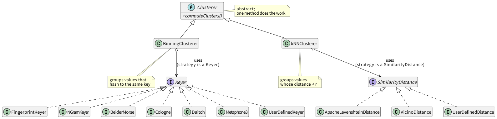
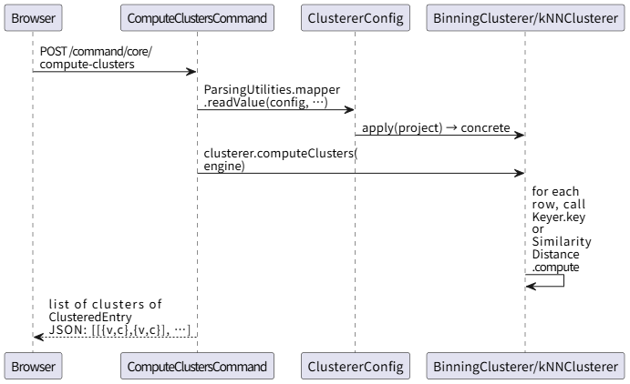
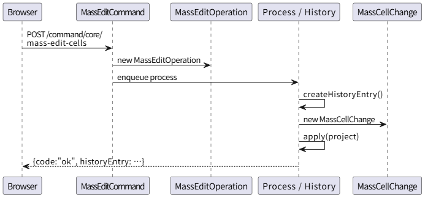

# Feature 1 Packet — Clustering and Edit

---

## 1. What the feature does

In OpenRefine, "Cluster and edit" is the workflow that finds groups of cell values that are *probably the same thing* spelled differently — `"NYC"`, `"New York City"`, `"new-york"` — so the user can collapse them to a single canonical value with one click.

The user-visible flow is:

1. User opens the **Cluster and edit** dialog on a column.
2. UI asks the server which clustering methods and distance functions are available.
3. UI sends a request with `(method, function/distance, parameters)`. Server runs clustering on that column and returns a list of clusters, each containing several `ClusteredEntry` rows (`{value, count}`).
4. User picks a canonical value per cluster and clicks **Merge selected & re-cluster**.
5. UI sends one `MassEditCommand` per column, which records a `MassCellChange` so the project history can undo it.

## 2. Where it lives in the UML diagram

All of the classes named in this packet are filled with **light blue (`#87CEFA`)** in `OpenRefine.drawio`. There are 27 of them. They split into five sub-areas:

| Sub-area | Classes |
| --- | --- |
| Algorithm core | `Clusterer`, `ClustererConfig`, `ClusteredEntry`, `BinningClusterer`, `kNNClusterer` |
| Binning keyers (strategy) | `Keyer`, `KeyerFactory`, `Fingerprint`, `FingerprintKeyer`, `NGramFingerprintKeyer`, `BeiderMorseKeyer`, `ColognePhoneticKeyer`, `DaitchMokotoffKeyer`, `Metaphone3`, `Metaphone3Keyer`, `UserDefinedKeyer` |
| kNN distance functions (strategy) | `SimilarityDistance`, `DistanceFactory`, `ApacheLevenshteinDistance`, `VicinoDistance`, `UserDefinedDistance` |
| HTTP commands | `GetClusteringFunctionsAndDistancesCommand`, `ComputeClustersCommand` |
| Apply chosen edits | `EditOneCellCommand`, `MassEditCommand`, `MassEditOperation`, `MassCellChange` |

## 3. Where it lives in the source tree

| Path | What's there |
| --- | --- |
| `modules/core/src/main/java/com/google/refine/clustering/` | `Clusterer`, `ClustererConfig`, `ClusteredEntry` |
| `modules/core/src/main/java/com/google/refine/clustering/binning/` | `BinningClusterer`, `Keyer`, `KeyerFactory`, `FingerprintKeyer`, `NGramFingerprintKeyer` |
| `main/src/com/google/refine/clustering/binning/` | `BeiderMorseKeyer`, `ColognePhoneticKeyer`, `DaitchMokotoffKeyer`, `Metaphone3Keyer`, `Metaphone3`, `UserDefinedKeyer` |
| `modules/core/src/main/java/com/google/refine/clustering/knn/` | `kNNClusterer`, `SimilarityDistance`, `DistanceFactory`, `ApacheLevenshteinDistance`, `VicinoDistance` |
| `main/src/com/google/refine/clustering/knn/` | `UserDefinedDistance` |
| `main/src/com/google/refine/commands/browsing/` | `ComputeClustersCommand`, `GetClusteringFunctionsAndDistancesCommand` |
| `main/src/com/google/refine/commands/cell/` | `EditOneCellCommand`, `MassEditCommand` |
| `main/src/com/google/refine/operations/cell/` | `MassEditOperation` |
| `modules/core/src/main/java/com/google/refine/model/changes/` | `MassCellChange` |

## 4. The two strategy hierarchies, in plain English

The clustering subsystem is two parallel **Strategy** patterns, glued together by an abstract `Clusterer`.



The two factories `KeyerFactory` and `DistanceFactory` are static singletons that hold a `Map<String, Keyer>` / `Map<String, SimilarityDistance>` so the clustering code can look up a strategy by its UI-facing name (e.g. `"fingerprint"`, `"ngram-fingerprint"`, `"levenshtein"`).

`ClustererConfig` is the JSON-deserialised request payload coming from the UI; each concrete clusterer has a nested `Config` subclass (`BinningClusterer.BinningClustererConfig`, `kNNClusterer.kNNClustererConfig`) that knows how to pick its strategy from the registry.

`ClusteredEntry` is the `{value, count}` pair returned to the UI for each value inside a cluster.

## 5. Sequence diagram — request to compute clusters



## 6. Sequence diagram — apply chosen edits

The UI sends one `MassEditCommand` per column. The server turns it into a `MassEditOperation`, which when run produces a `MassCellChange` and pushes it onto the project history.



`EditOneCellCommand` is the single-cell counterpart and is what the dialog also invokes when the user types directly into a single cell of the cluster preview.

## 7. Recipes for likely changes

### 7a. Add a new key function (binning)

**Goal:** add a Soundex keyer named `"soundex"` so users can pick it from the dropdown.

1. Create `SoundexKeyer extends Keyer` in `main/src/com/google/refine/clustering/binning/`.
   ```java
   public class SoundexKeyer extends Keyer {
       @Override
       public String key(String s, Object... params) {
           return new Soundex().encode(s);
       }
   }
   ```
2. Register it. There are two ways depending on the OpenRefine version:
   - In code: `KeyerFactory.put("soundex", new SoundexKeyer());`
   - Via the controller registration done at startup (search for other `KeyerFactory.put(...)` calls and copy the pattern).
3. The keyer name becomes the value of `"function"` in the JSON config the UI posts. No UI change is needed if you also add the entry to `GetClusteringFunctionsAndDistancesCommand`'s response (or to the data structure it reads from).
4. Add a unit test under `main/tests/.../clustering/binning/` mirroring `FingerprintKeyerTests`.

### 7b. Add a new distance function (kNN)

Same shape as 7a but for the `SimilarityDistance` interface and `DistanceFactory`. Implement `compute(String a, String b)` to return a value where smaller = more similar.

### 7c. Add a brand-new clustering algorithm

If neither "key collision" nor "kNN" fits, add a third subclass next to `BinningClusterer` / `kNNClusterer`:

1. Subclass `Clusterer` and implement `computeClusters(Engine)`.
2. Subclass `ClustererConfig` so JSON deserialisation works; override `apply(Project)` to instantiate your clusterer.
3. Register the new config type with Jackson polymorphism (look at how `BinningClustererConfig` and `kNNClustererConfig` are wired — they use `@JsonTypeInfo` on `ClustererConfig`).
4. Make `GetClusteringFunctionsAndDistancesCommand` advertise the new method to the UI.

### 7d. Change how edits are applied after clustering

The "edit" half is *not* clustering-specific. Two entry points:
- Single cell: `EditOneCellCommand` → `CellChange`.
- Many cells (used by the cluster dialog): `MassEditCommand` → `MassEditOperation` → `MassCellChange`.

If you want to record additional metadata per merge (e.g. provenance), you'd extend `MassCellChange` (or add a sibling change type) and update `MassEditOperation.createHistoryEntry()` to emit it. `MassCellChange` is what knows how to undo.
