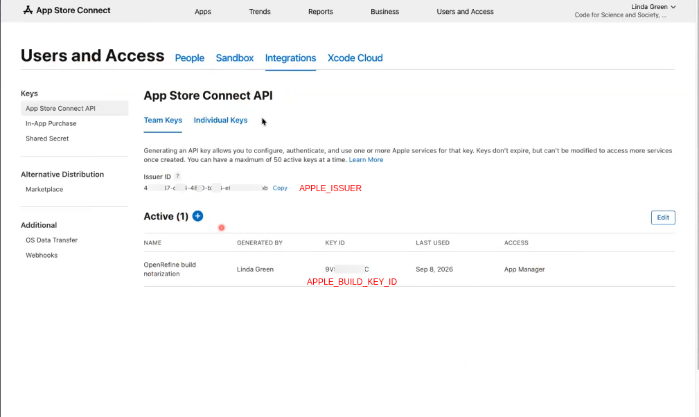
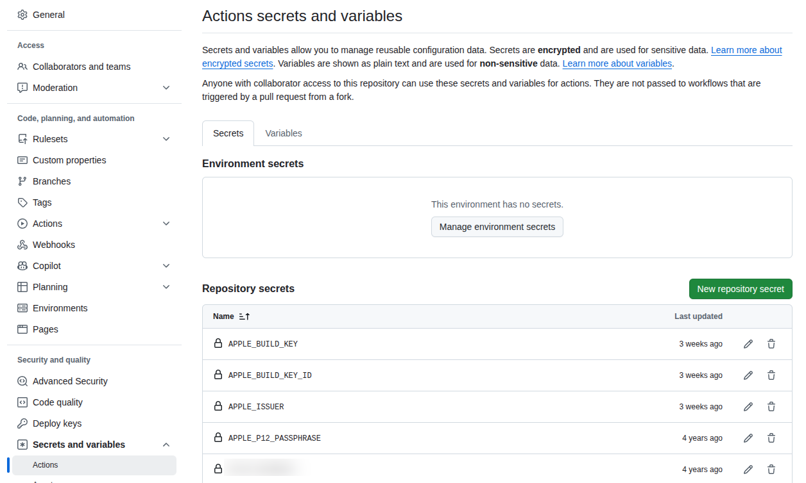

Apple distribution certificates
===============================

Those certificates are used to code-sign OpenRefine binaries.
They are decoded in the CI using the embedded GPG key.

## Introduction

OpenRefine is notarized with Apple so that macOS Gatekeeper does not block it when
users first open the application. The notarization key must be retrieved from
https://appstoreconnect.apple.com/. The account is managed via our
[fiscal sponsor CS&S](https://github.com/OpenRefine/OpenRefine/blob/master/GOVERNANCE.md#fiscal-sponsorship-code-for-science-and-society),
which allows us to benefit from their 501(c)(3) status and have the Apple Developer
Program membership fee waived.

## Secret management

The notarization process requires 3 secrets. The secret names match what is defined in
[snapshot_release.yml](https://github.com/OpenRefine/OpenRefine/blob/master/.github/workflows/snapshot_release.yml)
and under `Settings → Secrets and variables → Actions` (you need to be part of the
[OpenRefine Admin team](https://github.com/orgs/OpenRefine/teams/admins) to access the page)

* `APPLE_BUILD_KEY`: the full PEM text of the App Store Connect API private key,
  `AuthKey_XXXXXXXXXX.p8`, BEGIN/END lines included. Only the Account Holder or an Admin
  can generate the key. Once generated we cannot retrieve it a second time.
* `APPLE_BUILD_KEY_ID`: the 10-character Key ID identifying which key in the team signed
  the JWT. It is also the `XXXXXXXXXX` portion of the `.p8` filename, and is shown as
  KEY ID in App Store Connect.
* `APPLE_ISSUER`: the 36-character issuer UUID identifying the CS&S App Store Connect
  team, under Users and Access → Integrations.

For the record the `APPLE_P12_PASSPHRASE` is unrelated to notarization. It unlocks the
Developer ID Application certificate when signing the code before we submit it for
notarization

*The Issuer ID and Key ID above are partially masked. Enough is left visible to show the
format of each value.*

## Apple permission

- **Account Holder**. Currently Linda Green (linda@codeforsociety.org). As per Apple policy,
  only a CS&S employee (not a contractor) can be assigned. This role must approve the Terms
  of Service when they are updated, which happens about every other month.
- **Admin**. Currently Linda and Martin Magdinier (martin@openrefine.org). We can
  extend invitation to any user with CS&S approval.
  This role can generate new `.p8` keys and invite other members.
- **App Manager**. Not assigned to any person. The API key itself is created with App
  Manager access, which is sufficient to notarize. A person holding this role cannot
  create keys or view Users and Access, so it does not help with credential rotation.
